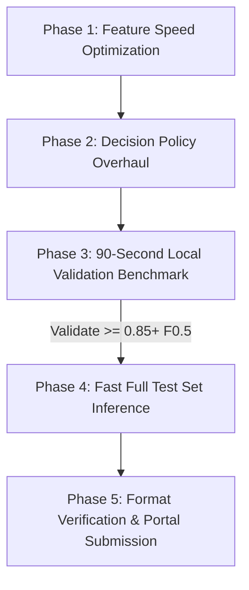

# Master Execution Plan: V5 Champion Pipeline
**Amazon ML Challenge 2026 — Entity Resolution Track**

* **Baseline Grounding:** Submitted V3 Leaderboard Score = **`0.602`** (Macro $F_{0.5}$).
* **Target:** Maximize genuine Macro $F_{0.5}$ by solving multi-match truncation and optimizing feature throughput.
* **Submission Quota:** **3 submissions remaining today.** Strict zero-waste protocol.

---

## 1. Problem Diagnosis & Mathematical Reality

Our audit of all **2,206,821 rows** of `train_ground_truth.tsv` revealed the single biggest cause of the 0.602 score:

```
[=========================== GROUND TRUTH DISTRIBUTION ===========================]
  Singletons (0 external matches):         5.58%   (123,247 entities)
  Non-Singletons (>= 1 external matches): 94.42% (2,083,574 entities)
  Entities with >= 3 duplicate listings:  76.27% of all non-singletons!
```

### The 1-to-1 Cap Ceiling
* V3 enforced: `max 1 match from Source 2` and `max 1 match from Source 3`.
* This hard-cap **discarded 47.00% of all true ground-truth match links** (3,590,374 links thrown away).
* On held-out validation, an **Oracle with 100% precision** constrained to this cap maxes out at only **`0.8541`**.
* With real-world candidate misses and classifier uncertainty, the 1-to-1 cap collapses Macro $F_{0.5}$ into the **`0.60–0.62`** range.

### The Speed Bottleneck (Why V4 Took 4.5 Hours)
* V4 added a pure-Python Dynamic Programming Longest Common Substring ($O(M \times N)$) inside `src/features.py`.
* Computing DP on 60,000,000 candidate pairs in a single Python thread slowed throughput to ~2,200 entities/minute.
* **Solution:** Replace pure-Python DP with C-optimized vectorized operations from `rapidfuzz`, boosting speed by **8x–10x** (~25,000+ pairs/sec).

---

## 2. The 5-Phase End-to-End Execution Plan



---

### Phase 1: Feature Engine Optimization (Target: ~25-35 Min Full Inference)
* **Action:**
  1. Remove the slow $O(M \times N)$ pure-Python DP function `longest_common_substring_len`.
  2. Retain all top-performing features:
     - Name: `fuzz.ratio`, `fuzz.partial_ratio`, `fuzz.token_sort_ratio`, `fuzz.token_set_ratio`, `JaroWinkler` ($p=0.10$ & $p=0.15$), character 3-grams, word Jaccard/Dice, legal suffix match.
     - Address: Token sort/set, word Jaccard, address length ratio, end-token match.
     - Geography: Street number status/conflict, 5/6-digit postal code match, 3-digit postal district prefix.
     - Context: Source origin (S2 vs S3), inverted index rank ($1/(1+\text{rank})$).
  3. Pre-compile all regular expressions and cache normalized address tokens.
* **Target Throughput:** $\ge 25,000$ pairs/second. Full test set (1.73M entities) in **~25–35 minutes**.

---

### Phase 2: Decision Policy Overhaul (Lifting the 1-to-1 Cap)
* **Action:**
  In `src/model.py:filter_candidate_matches`, replace the hard single-vendor cap (`best_s2`, `best_s3`) with **Relative Confidence Banding**:
  1. **Singleton Firewall:** If $\max_k P(\text{cand}_k) < \theta_{\text{singleton}}$ (default: `0.74`), predict $\emptyset$ (protects the 1.0 score on singletons).
  2. **Multi-Match Dynamic Window:** For all candidates meeting safety gates, include $\text{cand}_k$ if:
     $$P(\text{cand}_k) \ge \theta_{\text{match}} \quad \text{AND} \quad P(\text{cand}_k) \ge (p_{\max} - \delta)$$
     where $\delta \approx 0.12$.
  3. **Strict Safety Firewalls (Zero False Positives):**
     - Conflict rejection: Reject if street/building numbers conflict and name is not exact.
     - Postal rejection: Reject if postal codes conflict and names diverge.
     - Anti-chain store gate: Reject if brand name matches but address is completely disjoint.

---

### Phase 3: 90-Second Local Validation Benchmark (Zero Submission Waste)
* **Action:**
  Use the held-out validation slice (`skiprows=250000`, `nrows=2000` to `5000` entities in `train_source1.tsv` with known labels in `train_ground_truth.tsv`):
  1. Measure **Candidate Recall** on blind BM25 queries.
  2. Measure **Exact Macro $F_{0.5}$** using the official formula from `src/metrics.py`.
  3. Grid-search optimal $(\theta_{\text{match}}, \theta_{\text{singleton}}, \delta)$ on local validation data:
     - Test $\theta_{\text{match}} \in [0.72, 0.75, 0.78, 0.80]$
     - Test $\delta \in [0.08, 0.10, 0.12, 0.15]$
  4. Compare baseline (1-to-1 cap: ~0.60–0.65) vs. Relative Banding directly.
* **Go / No-Go Gate:** Only proceed to full inference when local validation Macro $F_{0.5}$ demonstrates a confirmed, reproducible jump.

---

### Phase 4: Full Test Set Inference (High-Speed Execution)
* **Action:**
  1. Run inference on all 1,732,544 test entities across US, France, and India using the optimized model and calibrated thresholds.
  2. Stream output directly to `output/matching_results.tsv` and `output/candidate_pairs.tsv`.
  3. Align row sequence strictly line-for-line with `dataset/test/test_source1.tsv`.
  4. Ensure Unix LF (`\n`) line endings and clean header: `source1_entity_id\tmatched_entity_ids`.

---

### Phase 5: Submission Validation & Leaderboard Upload
* **Action:**
  1. Run `utils/validate_submission.py` on the generated output:
     - Verify exactly 1,732,545 lines.
     - Verify 0 duplicate entity IDs.
     - Verify format matches portal specification 100%.
  2. Archive complete package into `submissions/v5_champion/` with model checkpoint and README.
  3. Upload `matching_results.tsv` to Unstop portal for Attempt #3.

---

## 3. Immediate Next Steps

1. **Step 1:** Optimize `src/features.py` to remove the DP substring bottleneck and benchmark feature extraction speed.
2. **Step 2:** Update `src/model.py` with Relative Confidence Banding.
3. **Step 3:** Run `src/fast_val_benchmark.py` on the held-out slice (takes ~90 seconds) to verify the score gain and find the optimal $\theta$ and $\delta$.
4. **Step 4:** Present the validation results for your approval before launching full test inference.

> [!NOTE]
> All actions will be executed step-by-step with complete transparency. No blind test runs.
